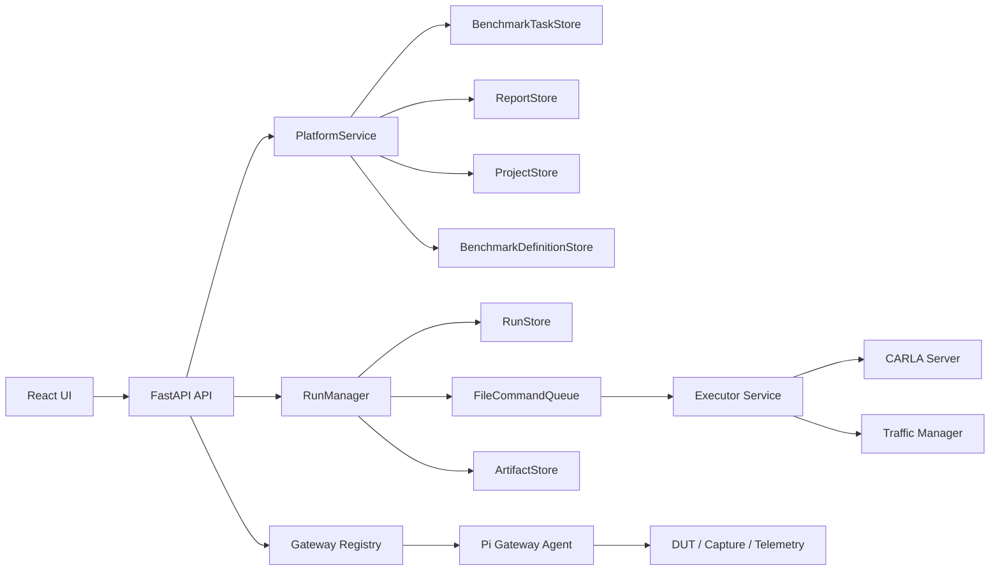

# 平台设计说明

## 1. 目标

平台目标不是单纯控制 CARLA，而是围绕芯片测评闭环组织系统：

- 算法工程师发起场景仿真测评
- 测试工程师批量执行多场景矩阵
- 设备侧回传遥测与评测指标
- 平台沉淀任务与报告资产

当前主线是：

`项目 -> 基准任务 -> benchmark task -> runs -> 执行器 / 网关 -> 指标汇总 -> report`

## 2. 分层架构

### 控制平面

负责：

- 请求校验
- 业务模型创建与查询
- 任务编排
- 报告导出

主要目录：

- `app/api`
- `app/platform`
- `app/storage`

### 执行平面

负责：

- run 生命周期
- CARLA 连接与地图加载
- 同步模式与 tick 推进
- artifact 记录

主要目录：

- `app/orchestrator`
- `app/executor`

### 设备 / 接入平面

负责：

- 网关注册与心跳
- 视频源接入
- 评测结果回传
- 功耗、温度、FPS 等指标上报

主要目录：

- `app/api/routes_gateways.py`
- `app/hil`

## 3. 一等业务模型

### Project

`Project` 表示测评业务容器，不表示具体芯片型号。

规则：

- 首页和项目页展示 `project`
- 不在项目层写死具体 DUT 型号
- 默认种子项目采用通用测评项目语义

### Benchmark Definition

`BenchmarkDefinition` 表示模板，定义：

- 关注指标
- 报告形态
- 执行节奏
- 默认评测协议

### Benchmark Task

`BenchmarkTask` 是这次重构新增的核心模型。

它持久化：

- `project_id`
- `project_name`
- `dut_model`
- `benchmark_definition_id`
- `scenario_matrix`
- `hil_config`
- `evaluation_profile_name`
- `run_ids`
- `summary`

含义：

- 一个 task 是一次完整测评任务
- 一个 task 可展开出多个 `run`
- 报告按 task 聚合，而不是按单个 run 聚合

### Run

`Run` 仍然是执行最小单元。

约束：

- 一个 run 对应一次场景执行
- run 由后端根据 task 的场景矩阵展开生成
- run metadata 会带 `project` / `benchmark` / `task` 标签
- `dut_model` 通过 metadata 透传到执行详情与报告链路

### Report

`Report` 是导出后的稳定资产，当前提供：

- `report.json`
- `report.md`

后续可在这个模型上增加：

- PDF
- A/B 对比
- 任务级重跑摘要

## 4. 数据流

### 4.1 创建任务

1. 前端从 `/projects`、`/benchmark-definitions`、`/maps`、`/scenario-catalog` 拉取选项。
2. 执行中心收集：
   - 所属项目
   - 基准模板
   - DUT 型号
   - 场景矩阵
   - 设备绑定
   - 评测协议
3. 前端调用 `POST /benchmark-tasks`。
4. `PlatformService.create_benchmark_task()` 校验场景、地图、天气、传感器、评测协议和设备。
5. 后端为每个矩阵项生成一个 `run`。
6. 若 `auto_start=true`，则把生成的 runs 依次放入队列。

### 4.2 运行执行

1. `RunManager` 创建 run 记录并落盘。
2. `FileCommandQueue` 提供 executor 轮询的命令入口。
3. `app.executor.service` 从命令队列消费 run。
4. executor 加载地图、应用环境、启动场景并写 artifacts。
5. 前端通过 `/runs` 和 `/system/status` 轮询状态。

### 4.3 导出报告

1. 前端从 `/benchmark-tasks` 选择一个已终态任务。
2. 调用 `POST /reports/export`。
3. 后端基于 task summary 与 scenario matrix 生成 `report.json` 和 `report.md`。
4. 前端在报告中心展示，并允许下载。

## 5. 地图策略

平台当前统一采用“展示层归一化、执行层优先 Opt”的规则。

规则：

- UI 只展示 `Town01`、`Town02` 这类家族名称
- 若同时存在 `Town01` 和 `Town01_Opt`，后端优先使用 `Town01_Opt`
- `scenario_matrix` 中保留：
  - `requested_map_name`
  - `resolved_map_name`
  - `display_map_name`

这样做的原因：

- 减少前端配置歧义
- 保持任务记录可追溯
- 优先使用优化地图提升执行稳定性

## 6. DUT 策略

本轮重构后的规则：

- DUT 型号不是首页、项目页或基准模板页的固定目录项
- DUT 型号属于接入 / 运维登记信息
- 由测试人员在执行中心创建任务时录入
- 任务、run metadata、报告都会带出 DUT 型号

这样可以避免：

- 把演示板卡误当成平台固定业务实体
- 前端长期暴露临时演示型号
- 报告无法区分“项目”与“实际待测对象”

## 7. 存储策略

当前仍是文件型持久化。

优点：

- 易于调试
- 与 executor 本地 artifacts 一致
- 适合单机 / 单容器联调

局限：

- 不适合高并发
- 多实例共享与事务能力弱
- 需要显式迁移默认 seed 数据

当前已做的轻量迁移：

- 旧的演示芯片项目种子会自动替换为通用测评项目种子
- 默认 benchmark definitions 的 `project_ids` 会迁移到新项目集合

## 8. 前端交互约束

### 选择器

对于“场景池 / 地图 / 天气 / 传感器模板”这类高密度选项，统一采用下拉多选，不在页面堆满大块按钮卡片。

### 项目与 DUT 分离

- 项目页展示测评项目
- DUT 型号仅在执行中心和设备侧语义里出现
- 报告显式展示 DUT 型号

### 页面职责

- `场景集`：规划矩阵，不直接写业务实体
- `执行中心`：创建任务、登记 DUT、绑定设备
- `报告中心`：总览与导出
- `设备中心`：网关、采集和 DUT 接入视角

## 9. 当前限制

- 报告导出还没有 PDF。
- 功耗、温度、mAP、延迟等值仍依赖网关或评测结果上报。
- `BenchmarkTask` 已是一等模型，但任务级停止 / 重跑 / 对比接口仍可继续增强。
- 文件型存储仍然是开发态实现，不是最终生产态方案。
