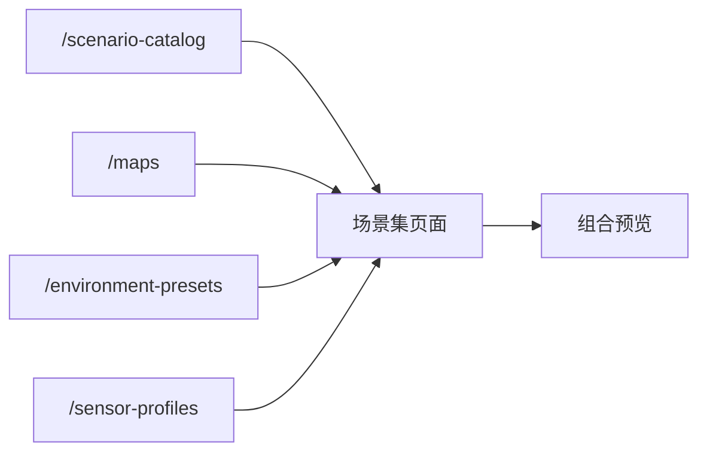
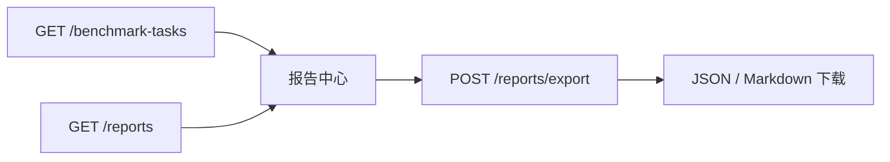

# Frontend Architecture Notes

保留原文件名是为了兼容历史引用，但内容已经更新到当前的前端重构版本。

## 1. 当前前端定位

前端不再是最小控制台，而是芯片测评平台的业务工作台。

主导航为：

- `项目`
- `基准任务`
- `场景集`
- `执行中心`
- `报告中心`
- `设备中心`

设计目标：

- 首页优先看业务指标，不被设备细节淹没
- 批量任务创建优先服务算法 / 测试工程师
- 底层接入能力下沉到设备中心

## 2. 页面职责

### 项目

展示测评项目，不展示固定芯片型号。

页面关注：

- 业务目标
- 覆盖指标
- 最近任务状态

禁止：

- 在项目页写死 `Jetson Nano`、`RK3568` 这类演示型号

### 基准任务

展示测评模板、评测协议和最近任务摘要。

页面关注：

- 模板定义
- 聚焦指标
- 当前任务数量

### 场景集

只做矩阵规划，不直接创建后端实体。

页面关注：

- 场景选择
- 地图选择
- 天气选择
- 传感器模板选择
- 组合预览

### 执行中心

这是前端主流程页面。

页面关注：

- 所属项目
- 基准任务模板
- DUT 型号
- 设备绑定
- 场景矩阵
- 任务创建与调度

### 报告中心

分成两个层次：

- 运营总览
- 工程分析与下载

### 设备中心

承接：

- 网关状态
- 采集链路
- DUT 接入登记语义

## 3. 数据获取规则

前端统一通过 `src/api/*` 请求后端。

当前主要 client：

- `src/api/projects.ts`
- `src/api/benchmarks.ts`
- `src/api/reports.ts`
- `src/api/runs.ts`
- `src/api/scenarios.ts`
- `src/api/gateways.ts`

规则：

- 页面层不直接写 `fetch`
- 服务端状态统一交给 `TanStack Query`
- 页面本地输入状态用 `useState`

## 4. 交互约束

### 高密度选项统一下拉化

场景、地图、天气、传感器模板等大量选项，统一使用下拉多选组件。

原因：

- 避免页面出现大块按钮矩阵
- 减少一次性视觉负担
- 保持“先选条件，再看摘要”的工作流

当前组件：

- `src/components/common/MultiSelectDropdown.tsx`

### DUT 型号录入

规则：

- DUT 型号不是项目字典
- DUT 型号由测试人员在创建任务时录入
- 执行详情和报告读取 task / run metadata 中的 DUT 信息

### 地图展示策略

规则：

- 页面只展示归一化后的 `TownXX`
- 由后端把请求统一映射到 `TownXX_Opt`
- 前端预览展示 `display_name`

## 5. 页面级数据流

### 场景集

### 执行中心

### 报告中心

## 6. 组件分层

### 页面组件

位置：

- `src/pages/*`

职责：

- 组合 query / mutation
- 持有页面局部状态
- 组装页面布局

### 通用组件

位置：

- `src/components/common/*`

职责：

- 统一卡片、面板、状态 pill、进度条、图表、空状态
- 统一高密度选择器样式

### 领域辅助

位置：

- `src/lib/platform.ts`

职责：

- 从 run / gateway 推导指标
- 解析 metadata 标签
- 统一格式化辅助逻辑

## 7. 视图层禁止事项

- 不在页面组件内直接散落 REST 请求。
- 不在视图层写地图归一化逻辑。
- 不在首页和项目页展示硬编码芯片型号。
- 不把高密度配置做成整屏卡片堆叠。
- 不把 task 级聚合再次退化成前端临时拼接。

## 8. 当前未完成项

- 报告页还没有 PDF 导出。
- 任务级重跑 / 停止 / 对比页面还未补齐。
- 运行中图表和实时流仍以轮询为主，未切换到推送机制。
